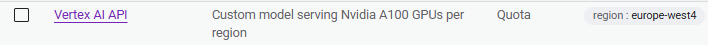

# Prerequisites

> [!NOTE]
> **Execution Context:** Google Cloud Console / Web Browser

The required APIs (Vertex AI, Artifact Registry, Compute Engine) must be enabled, and at least one A100 GPU quota has been approved.

## Enabling APIs

1.  Go to the Google Cloud search bar and type “APIs & Services”.
2.  On the left panel, click “Library”, then search for the following APIs one by one:
    *   **Vertex AI API**
    *   **Artifact Registry API**
    *   **Compute Engine API**
3.  Open each result and click “Enable”.

## A100 GPU Quota

1.  Search for “IAM & Admin” in the Google Cloud console.
2.  From the left panel, click “Quotas & System Limits”.
3.  Once on the page, apply the following filters:
    *   **Service**: “Vertex AI API” — because we’ll deploy through Vertex AI.
    *   **Metric**: “A100” — since we are using the A100 GPU (if you’re using another GPU, filter accordingly).
    *   **Region**: “europe-west4” — select the region where you’ll run the deployment (adjust if using a different one).

Ensure you have at least one A100 GPU approved for use in Vertex AI.

## Next Step

Once prerequisites are met, proceed to [VM Setup & Folder Structure](02-vm-setup.md).
