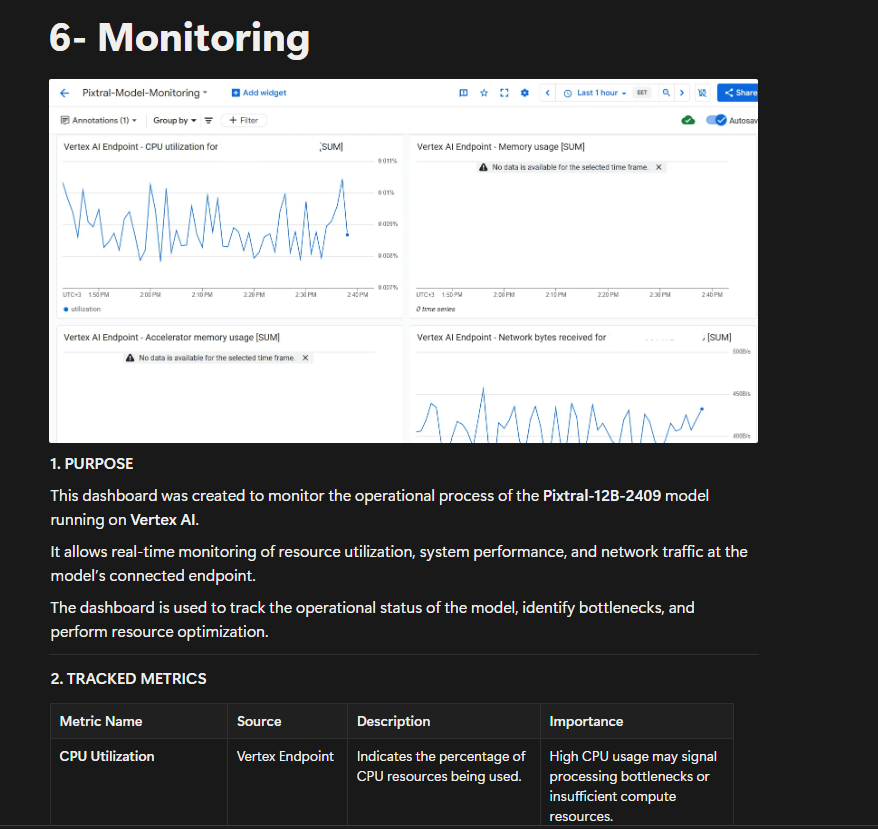

# Monitoring

> [!NOTE]
> **Execution Context:** Google Cloud Console / Web Browser

This dashboard was created to monitor the operational process of the Pixtral-12B-2409 model running on Vertex AI. It allows real-time monitoring of resource utilization, system performance, and network traffic at the model’s connected endpoint.

## 1. Tracked Metrics

| Metric Name | Source | Description | Importance |
| :--- | :--- | :--- | :--- |
| **CPU Utilization** | Vertex Endpoint | Indicates the percentage of CPU resources being used. | High CPU usage may signal processing bottlenecks or insufficient compute resources. |
| **Accelerator Memory Usage** | GPU | Measures the percentage of GPU memory utilization. | Approaching GPU memory limits can lead to Out-Of-Memory (OOM) errors. |
| **Memory Usage** | Vertex Endpoint | Monitors general RAM usage. | Helps detect memory leaks or inefficient resource allocation. |
| **Network Bytes Sent / Received** | Vertex Endpoint | Tracks the amount of data sent to and received from the model. | High or unbalanced traffic can indicate performance or scaling issues. |
| **Prediction Latency (p95)** | Vertex Endpoint | Measures the response time for model predictions (95th percentile). | Increasing latency may indicate system overload or slow inference performance. |
| **Prediction Count** | Vertex Endpoint | Counts the number of prediction requests over time. | Useful for analyzing usage patterns and autoscaling behavior. |

## 2. Dashboard Details

*   **Dashboard Name**: Pixtral-Model-Monitoring
*   **Project ID**: llm-development-XXXX
*   **Created on**: November 3, 2025
*   **Update Interval**: Every 1 minute (default monitoring refresh rate)
*   **Data Retention**: 6 weeks (default Google Cloud Monitoring setting)

## 3. Accessing the Dashboard

To open and monitor the Pixtral model dashboard on Google Cloud, follow these steps:

### Step 1 — Sign in to Google Cloud Console
1.  Go to [https://console.cloud.google.com](https://console.cloud.google.com).
2.  Sign in with your Google Cloud account credentials.
3.  Make sure you are using the correct project: **llm-development-XXXX**

### Step 2 — Open the Monitoring Section
In the left navigation menu, go to:
**“Monitoring” → “Dashboards”**
You will see a list of existing dashboards within the project.

### Step 3 — Locate the Pixtral Monitoring Dashboard
Search for the dashboard with the following name:
**Pixtral-Model-Monitoring**
Click on the dashboard name to open it.

### Step 4 — View and Analyze Metrics
Once the dashboard is open, you can:
*   Observe real-time system performance metrics (CPU, GPU, memory).
*   Analyze network activity and latency trends over time.
*   Adjust the view using the time range filters at the top (e.g., “Last 1 hour,” “Last 24 hours”).
*   Hover over any graph to view exact metric values for a specific timestamp.
